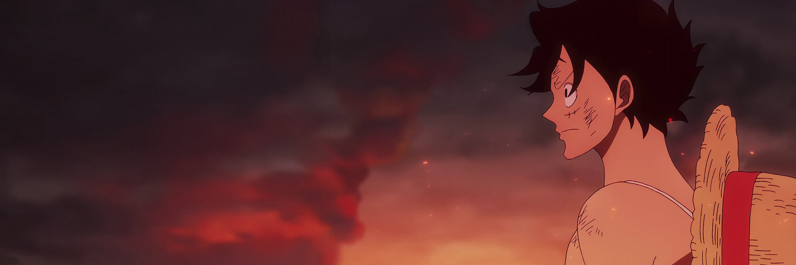
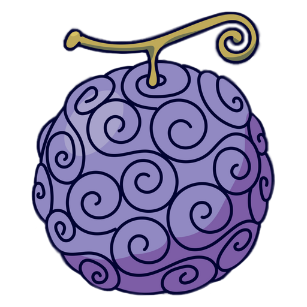

<!--
**lesi97/lesi97** is a ✨ _special_ ✨ repository because its `README.md` (this file) appears on your GitHub profile.
-->

# Chris Lesi

## into

-   anime
-   gaming
-   self hosting
-   development
-   photography
-   vegan cooking

---

## this github is mostly

-   experiments
-   personal projects
-   half finished ideas
-   things I made because I was curious

---

&nbsp;

---

<a href="https://www.viz.com/shonenjump/chapters/one-piece" target="_blank">
  
   
  Catch up to One Piece
</a>

